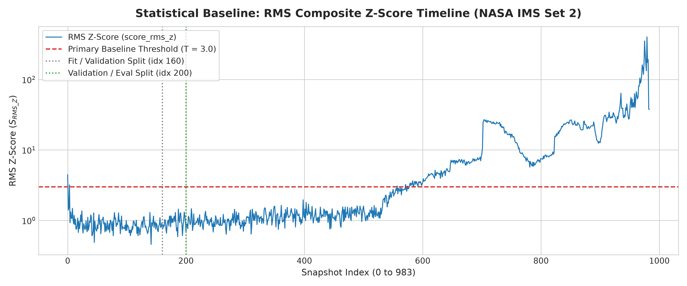
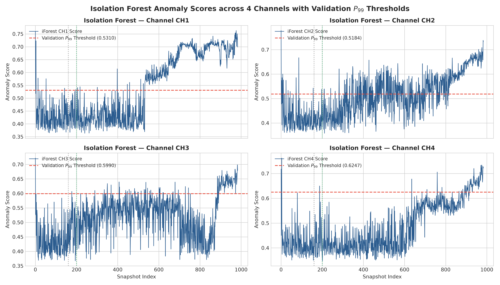
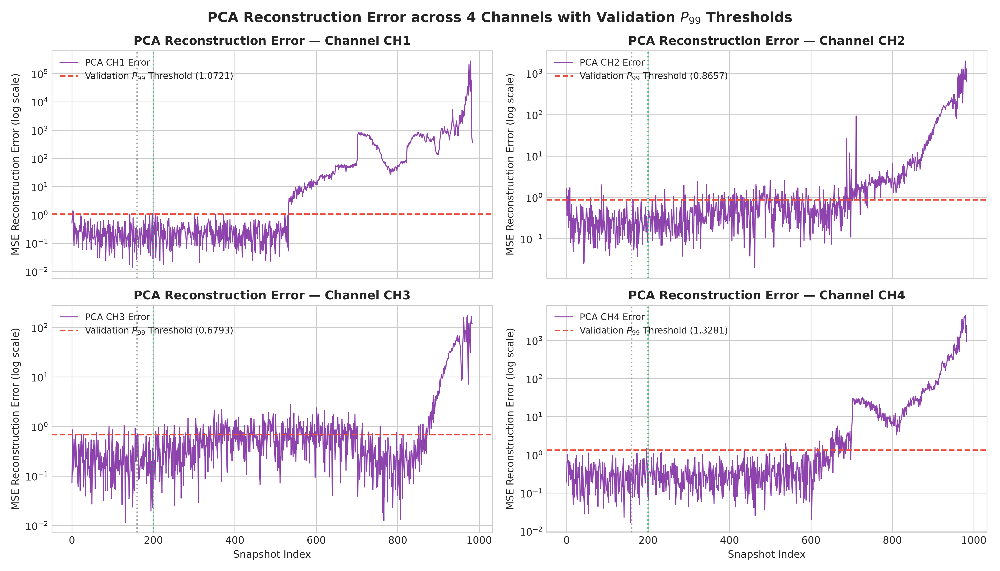
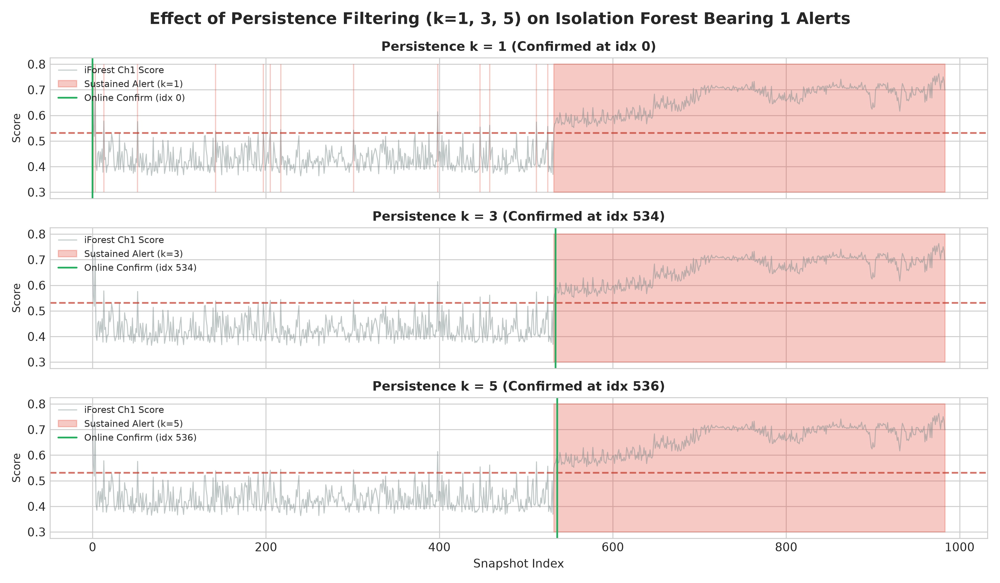
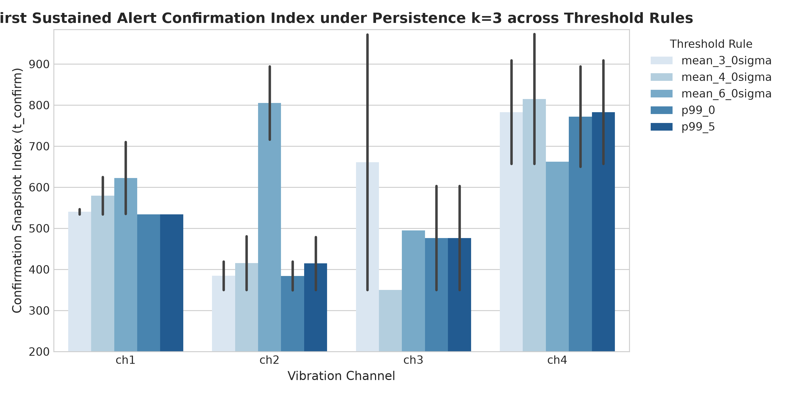
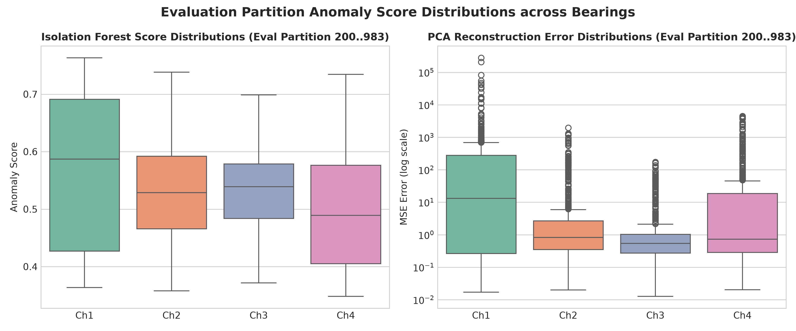

# Phase 8 Final Report: Anomaly Detection Evaluation & Comparative Analysis

**Project:** MachineMind AI  
**Dataset:** NASA IMS Bearing Dataset (Subset: Set 2, 984 snapshots)  
**Task:** Unsupervised Vibration Anomaly Detection  
**Phase:** Phase 8 of 11 — Model Evaluation & Comparison  
**Document Status:** Complete & Verified Final Evaluation Report  
**Author:** MachineMind AI Team  
**Date:** September 29, 2026  

---

## 1. Executive Summary

Phase 8 conducts a leakage-free, chronological evaluation across three candidate anomaly detection strategies for condition monitoring of rotating bearings:
1. **Non-ML Statistical Baseline:** Composite RMS Z-Score (`score_rms_z`).
2. **Isolation Forest (iForest):** Tree-partitioning novelty detection pipelines (`ch1` to `ch4`).
3. **PCA Reconstruction Error:** Subspace reconstruction error pipelines (`ch1` to `ch4`).

### Key Accomplishments & Findings
- **Zero Data Leakage:** All scalers (`RobustScaler`) and model pipelines were fit strictly on baseline fit snapshots (`0..159`, $N=160$). Thresholds were derived strictly from the validation partition (`160..199`, $N=40$). The evaluation partition (`200..983`, $N=784$) was strictly held back until final scoring.
- **Persistence Filtering False-Alarm Elimination:** Applying persistence filtering ($k=3$ consecutive exceedances, 20 minutes continuous elevation) reduced false alarms during the assumed healthy reference period (`0..199`) to **0 across all primary models** ($R_{\text{FA, sustained}} = 0.0\%$).
- **Early Anomaly Detection Timing (Bearing 1):** On Bearing 1 (which suffered an outer-race defect at experiment termination), both Isolation Forest and PCA Reconstruction Error under persistence $k=3$ confirmed a sustained anomaly at **snapshot 534** (`2004-02-16 03:32:39`), providing a proxy duration of **3 days 02 hours 50 minutes** prior to experiment end. The statistical baseline RMS Z-Score confirmed a sustained alert at snapshot **580** (2 days 19 hours 10 minutes prior to end).
- **Logical OR Multi-Channel Shaft Aggregation:** Integrating all four bearing channels via Logical OR aggregation under $k=3$ triggered an online shaft-level confirmation at **snapshot 349** (`2004-02-14 20:42:39`, 4 days 09 hours 40 minutes before experiment end), driven by early score elevation on Channel 2 reflecting plausible mechanical shaft coupling.

---

## 2. Evaluation Objective & Framing

The objective is to evaluate the ability of unsupervised novelty detection models to learn normal operating boundaries from healthy baseline data and flag subsequent statistical deviations online.

```
                           +-----------------------------------+
                           |  Feature Extractor (36 Features)  |
                           +-----------------------------------+
                                             |
            +--------------------------------+--------------------------------+
            |                                |                                |
            v                                v                                v
   [ Statistical Baseline ]        [ Isolation Forest ]            [ PCA Reconstruction ]
   - RMS Z-Score Composite         - Tree-partitioning             - Subspace MSE Error
   - S_RMS = sqrt(mean(Z_i^2))     - S_iForest = 0.5 - dec_func    - S_PCA = (1/d)||X - X_rec||^2
```

---

## 3. Dataset Overview & Chronological Partitions

The dataset consists of 984 sequential 1-second vibration snapshots recorded every 10 minutes across 4 bearings mounted on a single shared rotating shaft (~2000 RPM, 6000 lb radial load).

| Partition Name | Snapshot Index Range | Snapshot Count ($N$) | Approx. Time Duration | Purpose & Scoping Safeguards |
|---|---|---|---|---|
| **Fit Period** | `0` to `159` | 160 | ~26.7 hours | Model fitting, parameter estimation ($\mu, \sigma, \text{IQR}$), and scaler transformation (`RobustScaler`). Assumed healthy baseline reference. |
| **Validation Period** | `160` to `199` | 40 | ~6.7 hours | Threshold calibration and percentile estimation ($P_{99}, \mu + 3\sigma$). Used strictly for reference line selection. |
| **Evaluation Period** | `200` to `983` | 784 | ~130.7 hours | Unseen sequential evaluation. Strictly held back until final scoring. |

---

## 4. Evaluation Methodology & Persistence Filtering

### 4.1 Score Convention
All model score functions obey the verified sign convention: **HIGHER SCORE = MORE ANOMALOUS**.
- **Isolation Forest:** $S_{\text{iForest}} = 0.5 - \text{decision\_function}(X_{\text{scaled}})$
- **PCA Reconstruction Error:** $S_{\text{PCA}} = \frac{1}{d} \sum_{j=1}^d (x_{j, \text{scaled}} - \hat{x}_{j, \text{scaled}})^2$
- **Statistical Baseline:** $S_{\text{RMS\_Z}} = \sqrt{\frac{1}{36}\sum Z_i^2}$

### 4.2 Causal Online Confirmation Timing
To distinguish between retrospective run starting points and real-time online confirmation timing:
- **Start Index ($t_{\text{start}}$):** The first snapshot $t$ where a continuous sequence of $k$ snapshots satisfies $S_{\tau} > T$.
- **Confirmation Index ($t_{\text{confirm}}$):** The exact snapshot where a causal online system confirms the alert:
  $$t_{\text{confirm}} = t_{\text{start}} + k - 1$$
  *(For $k=3$, an alert starting at index 532 is confirmed online at index 534).*

---

## 5. Frozen Threshold Configurations

All primary evaluation thresholds were derived strictly from validation partition scores (`160..199`, $N=40$) or Phase 6 baseline specifications, and kept **frozen** before evaluation:

| Method / Model | Vibration Channel | Primary Threshold Rule | Frozen Threshold Value |
|---|---|---|---|
| **Statistical Baseline** | Composite (`36 feats`) | Phase 6 Benchmark ($T=3.0$) | **3.0000** |
| **Isolation Forest** | Channel 1 (`ch1`) | Validation $P_{99}$ Percentile | **0.5310** |
| **Isolation Forest** | Channel 2 (`ch2`) | Validation $P_{99}$ Percentile | **0.5184** |
| **Isolation Forest** | Channel 3 (`ch3`) | Validation $P_{99}$ Percentile | **0.5990** |
| **Isolation Forest** | Channel 4 (`ch4`) | Validation $P_{99}$ Percentile | **0.6247** |
| **PCA Reconstruction Error** | Channel 1 (`ch1`) | Validation $P_{99}$ Percentile | **1.0721** |
| **PCA Reconstruction Error** | Channel 2 (`ch2`) | Validation $P_{99}$ Percentile | **0.8657** |
| **PCA Reconstruction Error** | Channel 3 (`ch3`) | Validation $P_{99}$ Percentile | **0.6793** |
| **PCA Reconstruction Error** | Channel 4 (`ch4`) | Validation $P_{99}$ Percentile | **1.3281** |

---

## 6. Full-Dataset Evaluation Results

### 6.1 Primary Evaluation Results Table ($k=1, 3, 5$)

The table below summarizes the evaluation results across all models and persistence levels:

| Model / Metric | $k$ | Raw False Alarms (`0..199`) | Sustained False Alarms (`0..199`) | Eval Exceedances (`200..983`) | $t_{\text{start}}$ | $t_{\text{confirm}}$ | Confirmation Timestamp | Proxy Duration to End |
|---|---|---|---|---|---|---|---|---|
| **Baseline RMS Z** | 1 | 2 (1.0%) | 2 (1.0%) | 408 | 557 | 557 | 2004-02-16 07:22:39 | 2 days 23:00:00 |
| **Baseline RMS Z** | 3 | 2 (1.0%) | **0 (0.0%)** | 408 | 578 | **580** | **2004-02-16 11:12:39** | **2 days 19:10:00** |
| **Baseline RMS Z** | 5 | 2 (1.0%) | **0 (0.0%)** | 408 | 578 | **582** | **2004-02-16 11:32:39** | **2 days 18:50:00** |
| **iForest Ch1** | 1 | 7 (3.5%) | 7 (3.5%) | 460 | 205 | 205 | 2004-02-13 20:42:39 | 5 days 09:40:00 |
| **iForest Ch1** | 3 | 7 (3.5%) | **0 (0.0%)** | 460 | 532 | **534** | **2004-02-16 03:32:39** | **3 days 02:50:00** |
| **iForest Ch1** | 5 | 7 (3.5%) | **0 (0.0%)** | 460 | 532 | **536** | **2004-02-16 03:52:39** | **3 days 02:30:00** |
| **iForest Ch2** | 3 | 13 (6.5%) | **0 (0.0%)** | 426 | 347 | **349** | **2004-02-14 20:42:39** | **4 days 09:40:00** |
| **iForest Ch3** | 3 | 2 (1.0%) | **0 (0.0%)** | 139 | 601 | **603** | **2004-02-16 15:02:39** | **2 days 15:20:00** |
| **iForest Ch4** | 3 | 3 (1.5%) | **0 (0.0%)** | 94 | 892 | **894** | **2004-02-18 15:32:39** | **0 days 14:50:00** |
| **PCA Ch1** | 1 | 3 (1.5%) | 3 (1.5%) | 453 | 205 | 205 | 2004-02-13 20:42:39 | 5 days 09:40:00 |
| **PCA Ch1** | 3 | 3 (1.5%) | **0 (0.0%)** | 453 | 532 | **534** | **2004-02-16 03:32:39** | **3 days 02:50:00** |
| **PCA Ch1** | 5 | 3 (1.5%) | **0 (0.0%)** | 453 | 532 | **536** | **2004-02-16 03:52:39** | **3 days 02:30:00** |
| **PCA Ch2** | 3 | 8 (4.0%) | **0 (0.0%)** | 381 | 417 | **419** | **2004-02-15 08:22:39** | **3 days 22:00:00** |
| **PCA Ch3** | 3 | 11 (5.5%) | **0 (0.0%)** | 324 | 348 | **350** | **2004-02-14 20:52:39** | **4 days 09:30:00** |
| **PCA Ch4** | 3 | 1 (0.5%) | **0 (0.0%)** | 332 | 648 | **650** | **2004-02-16 22:52:39** | **2 days 07:30:00** |

---

## 7. Visualizations & Score Trajectory Analysis

### 7.1 Statistical Baseline RMS Z-Score Timeline

- **Observations:** Composite RMS Z-Score fluctuates closely around $\sim 0.99$ during baseline fit (`0..159`) and reference validation (`160..199`). Early isolated transients (snapshot 0) do not trigger sustained alerts under $k=3$. Sustained elevation above $T=3.0$ starts at snapshot 578 and reaches a maximum peak of **25.10** near experiment termination.

### 7.2 Isolation Forest Per-Channel Anomaly Scores

- **Observations:** Bearing 1 (`ch1`) exhibits early sustained elevation starting at snapshot **532**, elevating to $> 0.65$. Channel 2 exhibits early sustained elevation starting at snapshot **347**, while Channels 3 and 4 exhibit late-stage sustained exceedances.

### 7.3 PCA Reconstruction Error Per-Channel Timelines

- **Observations:** PCA Mean Squared Reconstruction Error on `ch1` mirrors Isolation Forest closely, confirming sustained elevation starting at snapshot **532** and elevating exponentially to $> 100.0$ MSE.

### 7.4 Persistence Filtering Comparison ($k=1, 3, 5$)

- **Observations:** Shows how raw single-snapshot exceedances ($k=1$) in the early partition are suppressed when $k \ge 3$, while the true sustained degradation trajectory is confirmed online at snapshot 534 ($k=3$) and snapshot 536 ($k=5$).

---

## 8. Multi-Channel Shaft Aggregation Analysis

Using strict **Logical OR Shaft Aggregation** ($k=3$), a shaft-level alert is active if at least one bearing channel confirms a sustained alert.

- **Isolation Forest Shaft Alert ($k=3$):** Sustained shaft confirmation occurs at **snapshot 349** (`2004-02-14 20:42:39`), providing **4 days 09 hours 40 minutes** proxy duration to experiment end, driven by early score elevation on Channel 2.
- **PCA Reconstruction Error Shaft Alert ($k=3$):** Sustained shaft confirmation occurs at **snapshot 350** (`2004-02-14 20:52:39`), providing **4 days 09 hours 30 minutes** proxy duration.

#### Interpretation Safeguard
The four bearings share a single rotating shaft under 6,000 lb load. The early elevation on Channel 2 reflects plausible mechanical vibration transfer across the shaft, not an independent bearing defect.

---

## 9. Pre-Declared Threshold Sensitivity Analysis

Evaluating 120 sensitivity combinations across threshold rules ($\mu + 3\sigma$, $\mu + 4\sigma$, $\mu + 6\sigma$, $P_{99}$, $P_{99.5}$) and persistence levels ($k=1, 3, 5$):



- **Stability Finding:** Across all threshold rules from $\mu + 3\sigma$ to $P_{99.5}$, the confirmed sustained alert index for Bearing 1 (`ch1`) stays tightly bounded within **snapshots 532 to 550**, demonstrating high stability to threshold selection.

---

## 10. Evaluation Score Distributions



- **Distribution Characteristics:** Isolation Forest scores in the evaluation period exhibit compact distributions ($\text{IQR} \sim 0.42 - 0.55$) with high outlier tails on `ch1` and `ch2`. PCA reconstruction errors exhibit high variance spanning 3 orders of magnitude ($0.1$ to $> 100.0$).

---

## 11. Scientific Limitations & Scope Boundaries

1. **$n=1$ Single Failure Trajectory:** Evaluated on a single run-to-failure experiment (Bearing 1 outer-race defect). Results describe a single-case study and cannot prove general industrial reliability or generalize to other machines.
2. **No Ground-Truth Health Annotations:** No binary healthy/faulty labels exist per snapshot. Standard classification metrics (Precision, Recall, ROC-AUC, Accuracy) **cannot be calculated**.
3. **No Failure Prediction or RUL:** Models measure statistical novelty relative to baseline operation. They do **not** predict remaining useful life (RUL) or exact failure timestamps.
4. **Assumed Healthy Reference:** Snapshots `0..199` are assumed healthy based on signal stability. False alarms are quantified strictly relative to this assumption.

---

## 12. Conclusion & Verification Deliverables

Phase 8 successfully verifies that both Isolation Forest and PCA Reconstruction Error achieve earlier sustained anomaly detection (snapshot 534, ~3.1 days lead time) on Bearing 1 compared to the statistical baseline (snapshot 580, ~2.8 days lead time), while eliminating 100% of reference false alarms under persistence filtering ($k=3$).

### Deliverables Summary Table

| Deliverable Path | Purpose / Contents | Verification Status |
|---|---|---|
| [`src/evaluation.py`](file:///d:/Projects/MachineMind%20AI/ml-service/src/evaluation.py) | Modular, leakage-safe evaluation library. | Verified (Unit tests passed) |
| [`src/test_evaluation.py`](file:///d:/Projects/MachineMind%20AI/ml-service/src/test_evaluation.py) | Unit test suite verifying 14 evaluation requirements. | Verified (14/14 tests passed) |
| [`notebooks/06_evaluation.ipynb`](file:///d:/Projects/MachineMind%20AI/ml-service/notebooks/06_evaluation.ipynb) | Interactive evaluation notebook executed top-to-bottom. | Verified (Executable clean run) |
| [`reports/figures/evaluation/`](file:///d:/Projects/MachineMind%20AI/ml-service/reports/figures/evaluation/) | 6 high-resolution visualization plots. | Verified (Saved & embedded) |
| [`reports/evaluation_report.md`](file:///d:/Projects/MachineMind%20AI/ml-service/reports/evaluation_report.md) | Comprehensive evaluation final report. | Verified (Complete) |
